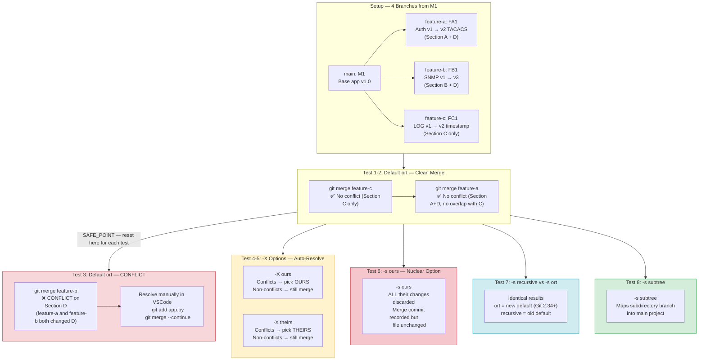

# Git Merge Strategies — Practice Lab

> **Lab path:** `~/DevnetExpert/mock3/design/git-ops`

---

## Theory — Merge Strategies vs Merge Options

Git merge has two separate flags that sound similar but do very different things:

**`-s` = Strategy** — The overall merge algorithm. Tells Git **how** to perform the entire merge.

**`-X` = eXtended option** — A tweak passed TO the strategy. Doesn't change the algorithm, just adjusts behavior on edge cases.

**Cooking analogy:**

| Flag | Analogy |
|---|---|
| `-s` | **The recipe** — "make a stir-fry" vs "make a soup" (completely different approach) |
| `-X` | **A tweak** — "make a stir-fry, but use extra chili" (same recipe, small adjustment) |

You can combine them:

```bash
git merge -s ort -X ours feature
#          ^^^^  ^^^^^^
#        strategy  option passed to ort
```

---

### Strategies (`-s`) — The Entire Algorithm

| Strategy | Command | What It Does |
|---|---|---|
| `ort` | `git merge -s ort` | **New default** (Git 2.34+). 3-way merge with rename detection. Replaced `recursive` |
| `recursive` | `git merge -s recursive` | **Old default** (pre 2.34). Same as `ort` but slower on edge cases |
| `ours` | `git merge -s ours` | **Discards ALL** their changes entirely. Records merge but keeps our version |
| `subtree` | `git merge -s subtree` | Merges when one branch is a **subdirectory** of another |
| `resolve` | `git merge -s resolve` | Simple 3-way merge. Only works with **one** common ancestor |

### Options (`-X`) — Tweaks to the Strategy

| Option | Command | What It Does |
|---|---|---|
| `ours` | `git merge -X ours` | On **conflicts only**, auto-pick our side |
| `theirs` | `git merge -X theirs` | On **conflicts only**, auto-pick their side |
| `subtree=path` | `git merge -X subtree=lib` | Adjust tree path for subdirectory matching |

### The Critical Exam Trap

```
-s ours  →  Discards ALL their changes (nuclear option)
-X ours  →  Only resolves CONFLICTS in our favor (non-conflicting changes still merge)
```

These look similar but behave completely differently:

| | `-s ours` (strategy) | `-X ours` (option) |
|---|---|---|
| Non-conflicting changes | ❌ Discarded | ✅ Merged normally |
| Conflicting changes | ❌ Discarded | Auto-pick our side |
| Their work preserved? | No — thrown away entirely | Yes — only conflicts lost |
| Use case | Abandon a branch cleanly | Auto-resolve conflicts in your favor |

---

---

## Practice Setup

### The Scenario

Four branches from one shared file (`app.py`):

```
main:       M1 (base)
feature-a:  FA1 (changes Section A + D)
feature-b:  FB1 (changes Section B + D) ← will CONFLICT with feature-a on Section D
feature-c:  FC1 (changes Section C only) ← no conflict with anyone
```

We merge them into main one by one using different strategies to see the difference.

---

## Step 1 — Clean Start

```bash
cd ~/DevnetExpert/mock3/design/git-ops
rm -rf .git *.py *.yaml *.md
git init

cat > app.py << 'EOF'
# === Network App v1.0 ===

# --- Section A: Auth ---
def authenticate(user):
    print("Auth v1")

# --- Section B: SNMP ---
def snmp_poll(device):
    print("SNMP v1")

# --- Section C: Logging ---
def log_event(msg):
    print("LOG v1")

# --- Section D: Main ---
if __name__ == "__main__":
    authenticate("admin")
    snmp_poll("R1")
    log_event("started")
EOF

git add app.py
git commit -m "M1: Base app v1.0"
git log --oneline
```

---

## Step 2 — Create feature-a (Changes Section A + D)

```bash
git checkout -b feature-a

sed -i 's/print("Auth v1")/print("Auth v2 TACACS")/' app.py
sed -i 's/authenticate("admin")/authenticate("netadmin")/' app.py

git add app.py
git commit -m "FA1: Upgrade auth to TACACS"
git log --oneline
```

---

## Step 3 — Create feature-b from main (Changes Section B + D)

```bash
git checkout main
git checkout -b feature-b

sed -i 's/print("SNMP v1")/print("SNMP v3")/' app.py
sed -i 's/snmp_poll("R1")/snmp_poll("SW1")/' app.py

git add app.py
git commit -m "FB1: Upgrade SNMP to v3"
git log --oneline
```

Both feature-a and feature-b changed Section D — this is where conflicts will happen.

---

## Step 4 — Create feature-c from main (Changes Section C only)

```bash
git checkout main
git checkout -b feature-c

sed -i 's/print("LOG v1")/print("LOG v2 with timestamp")/' app.py

git add app.py
git commit -m "FC1: Add timestamp to logging"
git log --oneline
```

---

## Step 5 — Verify Graph (4 branches from M1)

```bash
git log --oneline --graph --all
```

Expected:

```
* <hash> (feature-c) FC1: Add timestamp to logging
| * <hash> (feature-b) FB1: Upgrade SNMP to v3
|/
| * <hash> (feature-a) FA1: Upgrade auth to TACACS
|/
* <hash> (main) M1: Base app v1.0
```

```
feature-a:  M1 ── FA1  (Section A + D changed)
feature-b:  M1 ── FB1  (Section B + D changed)
feature-c:  M1 ── FC1  (Section C changed)
main:       M1
```

---

---

## Test 1 — Default Strategy (`ort`) — Clean Merge

```bash
git checkout main

git merge feature-c -m "Merge FC1: logging upgrade"

cat app.py
# Section C now shows: LOG v2 with timestamp
# Everything else unchanged

git log --oneline
```

No conflict — feature-c only touched Section C. Git used `ort` (default) automatically.

---

## Test 2 — Default Strategy (`ort`) — Another Clean Merge

```bash
git merge feature-a -m "Merge FA1: auth upgrade"

cat app.py
# Section A now shows: Auth v2 TACACS
# Section D now shows: authenticate("netadmin")

git log --oneline
```

Still no conflict — feature-a touched Section A + D, feature-c touched Section C. No overlap.

**Save this point — you'll reset here for each test:**

```bash
git log --oneline -1
# Note this hash — this is your SAFE_POINT (after FC1 + FA1 merged)
```

---

## Test 3 — Default Strategy (`ort`) — CONFLICT

```bash
git merge feature-b
```

**CONFLICT on Section D** — both feature-a and feature-b modified lines in the main block:

```
CONFLICT (content): Merge conflict in app.py
Automatic merge failed; fix conflicts and then commit the result.
```

```bash
# See the conflict markers
cat app.py
```

You'll see something like:

```python
<<<<<<< HEAD
    authenticate("netadmin")
    snmp_poll("R1")
=======
    authenticate("admin")
    snmp_poll("SW1")
>>>>>>> feature-b
```

Resolve manually:

```bash
# Edit in VSCode — keep both changes, remove markers
code app.py
```

Should become:

```python
    authenticate("netadmin")
    snmp_poll("SW1")
```

```bash
git add app.py
git merge --continue

git log --oneline --graph -5
```

Now reset for the next test:

```bash
git reset --hard <SAFE_POINT hash>
```

---

## Test 4 — `-X ours` (Auto-Pick Our Side on Conflicts)

```bash
git merge -X ours feature-b -m "Merge FB1 with -X ours"

cat app.py
```

| Section | What Happened |
|---|---|
| Section B | `SNMP v3` ✅ Merged (no conflict here) |
| Section D `authenticate` | `authenticate("netadmin")` — **OUR** version kept (conflict) |
| Section D `snmp_poll` | `snmp_poll("R1")` — feature-b's change **LOST** (conflict) |

Non-conflicting changes came through. Only conflicts picked our side.

```bash
# Verify
grep SNMP app.py    # v3 — merged (non-conflicting)
grep admin app.py   # netadmin — ours kept (conflict)
grep snmp app.py    # R1 — ours kept, SW1 lost (conflict)
```

Reset:

```bash
git reset --hard <SAFE_POINT hash>
```

---

## Test 5 — `-X theirs` (Auto-Pick Their Side on Conflicts)

```bash
git merge -X theirs feature-b -m "Merge FB1 with -X theirs"

cat app.py
```

| Section | What Happened |
|---|---|
| Section B | `SNMP v3` ✅ Merged (no conflict here) |
| Section D `authenticate` | `authenticate("admin")` — **THEIR** version kept (conflict) |
| Section D `snmp_poll` | `snmp_poll("SW1")` — feature-b's change **KEPT** (conflict) |

Opposite of `-X ours` — conflicts resolved in feature-b's favor.

```bash
grep admin app.py   # admin — theirs kept (our netadmin lost)
grep snmp app.py    # SW1 — theirs kept
```

Reset:

```bash
git reset --hard <SAFE_POINT hash>
```

---

## Test 6 — `-s ours` (Discard EVERYTHING from Feature)

```bash
git merge -s ours feature-b -m "Merge FB1 with -s ours (discard all)"

cat app.py
```

**NOTHING from feature-b** — no SNMP v3, no SW1, absolutely nothing changed.

```bash
grep SNMP app.py    # Still "SNMP v1" — even non-conflicting changes discarded!
grep snmp app.py    # Still "R1" — everything from feature-b thrown away
```

But the merge commit exists in history:

```bash
git log --oneline --graph -5
# Shows merge commit, but file is unchanged
```

**Use case:** Branch is abandoned or already handled manually. You want Git to record it as "merged" so it stops appearing as unmerged.

**This is why `-s ours` ≠ `-X ours`:**

| | `-s ours` (this test) | `-X ours` (Test 4) |
|---|---|---|
| SNMP v3 (non-conflicting) | ❌ Lost | ✅ Merged |
| Section D (conflicting) | ❌ Lost | Ours kept |

Reset:

```bash
git reset --hard <SAFE_POINT hash>
```

---

## Test 7 — `-s recursive` vs `-s ort`

```bash
# Old default (pre Git 2.34)
git merge -s recursive feature-b -m "Merge FB1 with recursive"

# Will conflict same as Test 3 — resolve it
cat app.py
# Fix conflicts same way
git add app.py
git merge --continue
```

```bash
git reset --hard <SAFE_POINT hash>

# New default (Git 2.34+)
git merge -s ort feature-b -m "Merge FB1 with ort"

# Same conflict, same resolution
```

Both produce identical results — `ort` is faster and handles rename detection better. If the exam asks: **`ort` replaced `recursive` as the default in Git 2.34+**.

```bash
# Check your Git version
git version

# If 2.34+ → default is ort
# If older → default is recursive
```

Reset:

```bash
git reset --hard <SAFE_POINT hash>
```

---

## Test 8 — `-s subtree` (Subdirectory Merge)

Different setup — one branch has files in a subdirectory:

```bash
# Create a branch from main with code inside a subdirectory
git checkout -b library

mkdir -p lib
cat > lib/helpers.py << 'EOF'
def net_helper():
    print("Library helper v1")
EOF

git add lib/
git commit -m "LIB1: Add helpers library"

# Back to main
git checkout main

# Subtree merge — maps library's content into main
git merge -s subtree library -m "Merge library using subtree strategy"

ls lib/
# helpers.py

cat lib/helpers.py
# Library helper v1
```

**Use case:** Merging a branch that represents a subdirectory of your project (like pulling in a shared library from another repo).

```bash
git log --oneline --graph -5
```

---

---

## Summary — All Strategies Tested

| Test | Command | Conflict Handling | Their Changes |
|---|---|---|---|
| Test 1 | `git merge feature-c` | Default `ort`, no conflict | ✅ All merged |
| Test 2 | `git merge feature-a` | Default `ort`, no conflict | ✅ All merged |
| Test 3 | `git merge feature-b` | Default `ort`, **manual resolve** | ✅ All merged (after fix) |
| Test 4 | `git merge -X ours feature-b` | Auto-pick ours on conflict | ✅ Non-conflicting merged |
| Test 5 | `git merge -X theirs feature-b` | Auto-pick theirs on conflict | ✅ Non-conflicting merged |
| Test 6 | `git merge -s ours feature-b` | No conflicts possible | ❌ ALL discarded |
| Test 7 | `git merge -s recursive` / `-s ort` | Same as Test 3 | ✅ All merged (after fix) |
| Test 8 | `git merge -s subtree library` | Subdirectory path adjustment | ✅ Mapped into directory |

---

## Workflow — Mermaid Graph



**Color key:**
- 🔴 **Red** — Conflict (manual resolve required)
- 🟡 **Yellow** — Auto-resolve options (`-X ours` / `-X theirs`)
- 🔴 **Dark Red** — Nuclear option (`-s ours` — discards everything)
- 🔵 **Blue** — Strategy comparison (`recursive` vs `ort`)
- 🟢 **Green** — Subtree strategy

---

## Exam Cheat Sheet

### All Strategies — Complete List (`-s`)

| Strategy | Branches | Handles Conflicts? | Default? | What It Does |
|---|---|---|---|---|
| `ort` | 2 | ✅ Yes | ✅ Yes (Git 2.34+) | 3-way merge with rename detection. Replaced `recursive` |
| `recursive` | 2 | ✅ Yes | Was default (pre 2.34) | Same as `ort`, slower on edge cases |
| `ours` | 2 | N/A — discards theirs | No | **Discards ALL** their changes. Records merge but keeps our version entirely |
| `subtree` | 2 | ✅ Yes | No | Merges when one branch is a subdirectory of another |
| `resolve` | 2 | ✅ Yes | No | Simple 3-way merge. Only works with one common ancestor |
| `octopus` | **3+** | ❌ Aborts on conflict | Auto-selected for 3+ branches | Merges **multiple branches** in one commit |

### Octopus Strategy

Merges more than 2 branches at once in a single merge commit. Git selects it automatically when you pass multiple branches:

```bash
# Instead of 3 separate merges:
git merge feature-a
git merge feature-b
git merge feature-c

# Octopus — ONE merge commit, 3 parents:
git merge feature-a feature-b feature-c
```

**The catch:** Octopus **refuses to handle conflicts**. If any branch conflicts with another, it aborts entirely. Only works when all branches merge cleanly.

### Options (`-X`) — Tweaks to the Strategy

| Option | Command | What It Does |
|---|---|---|
| `ours` | `git merge -X ours` | On **conflicts only**, pick our side |
| `theirs` | `git merge -X theirs` | On **conflicts only**, pick their side |
| `subtree=path` | `git merge -X subtree=lib` | Adjust tree path for subdirectory matching |

### The Trap

```
-s ours   =  "Throw away ALL their work"           (STRATEGY — entire algorithm)
-X ours   =  "On conflicts, prefer our version"    (OPTION — tweak to the algorithm)
```

### Ours vs Theirs — How to Remember

```bash
git checkout main              ← you're standing HERE = OURS
git merge feature-b            ← pulling THIS in = THEIRS
```

> **Ours = where I stand. Theirs = what I'm merging in.**

---

### Which Strategy Supports Rename Detection?

Only `ort` and `recursive` (and `subtree` which is built on top of them). This is one of the key reasons `ort` became the new default in Git 2.34+.

| Strategy | Rename Detection? | Notes |
|---|---|---|
| `ort` | ✅ Yes (improved) | Better and faster rename handling than recursive |
| `recursive` | ✅ Yes | Original rename detection |
| `resolve` | ❌ No | Simple 3-way, no rename awareness |
| `ours` | N/A | Discards their changes entirely — doesn't need it |
| `subtree` | ✅ Yes | Built on top of recursive/ort, inherits rename detection |
| `octopus` | ❌ No | Lightweight multi-branch merge, no rename support |

### What "Rename Detection" Means in Practice

```bash
# feature-a renamed auth.py → authentication.py and edited it
git mv auth.py authentication.py
# edited authentication.py

# main edited the same file but still called auth.py
# edited auth.py

# WITHOUT rename detection (resolve/octopus):
git merge -s resolve feature-a
# Treats it as: auth.py DELETED + authentication.py CREATED
# Your edits on main's auth.py are LOST

# WITH rename detection (ort/recursive):
git merge feature-a
# Git recognizes: "auth.py was renamed to authentication.py"
# Merges BOTH sets of changes into authentication.py
```

### Why `ort` Replaced `recursive`

Both detect renames, but `ort` does it better:

| | `recursive` | `ort` |
|---|---|---|
| Speed on many renames | Slow (O(n²) worst case) | Fast (optimized algorithm) |
| Multiple files renamed in same commit | Can get confused | Handles correctly |
| Directory renames | Limited support | ✅ Full support |
| Default since | Git 1.x | Git 2.34+ (2021) |

**Exam answer:** If asked "which strategy supports rename detection" — **`ort`** and **`recursive`**. `ort` does it faster and more accurately.

---

---

## Understanding 3-Way Merge (How Git Compares Files)

"3-way" does NOT mean 3 branches. It means Git compares **3 snapshots of the file** to decide what changed:

```
        M1  ← ANCESTOR (version 1) — where branches split
       /  \
    main    feature
  (version 2)  (version 3)
```

| Version | What It Is | Where Git Finds It |
|---|---|---|
| 1 — Ancestor | The **fork point** — last common commit | `git merge-base main feature` |
| 2 — Ours | The branch you're **standing on** | `HEAD` |
| 3 — Theirs | The branch you're **merging in** | The branch name after `git merge` |

### Why Git Needs the Ancestor

Without it, Git can't tell **who changed what**.

**With ancestor (3-way — correct):**

```
Ancestor:  snmp_poll("R1")       ← original
Ours:      snmp_poll("R1")       ← we DIDN'T change it
Theirs:    snmp_poll("SW1")      ← they DID change it

Git: "Only theirs changed → take theirs. No conflict."
```

**Without ancestor (2-way — wrong):**

```
Ours:      snmp_poll("R1")
Theirs:    snmp_poll("SW1")

Git: "They're different... but who changed it? CONFLICT!"
```

The ancestor is the **tiebreaker**.

### Simple Example

```bash
# M1: Create app.py on main
git checkout main
cat > app.py << 'EOF'
def fun():
    print("This is main")
EOF
git add app.py
git commit -m "M1: initial"

# F1: Add a feature line on feature branch
git checkout -b feature
cat > app.py << 'EOF'
def fun():
    print("This is main")
    print("Adding feature")
EOF
git add app.py
git commit -m "F1: add feature"

# Merge
git checkout main
git merge feature -m "M2F1"
```

The 3 versions:

| Version | Commit | `app.py` content |
|---|---|---|
| 1 — Ancestor | `M1` (fork point) | `print("This is main")` |
| 2 — Ours | `main` (still at M1) | `print("This is main")` |
| 3 — Theirs | `feature` (F1) | `print("This is main")`, `print("Adding feature")` |

Git's line-by-line decision:

| Line | Ancestor | Ours | Theirs | Decision |
|---|---|---|---|---|
| `print("This is main")` | ✅ exists | ✅ same | ✅ same | No change → keep |
| `print("Adding feature")` | *(none)* | *(none)* | ✅ added | Only theirs added → **take theirs** |

**Note:** In this case, ours and ancestor are identical (main never moved), so Git just **fast-forwards** — no 3-way comparison actually needed.

### When Does a Real 3-Way Merge Happen?

Only when **both branches have unique commits** (diverged):

```bash
# After creating feature, add something on main too:
git checkout main
cat > app.py << 'EOF'
def fun():
    print("This is main")
    print("Adding hotfix")
EOF
git commit -am "M2: hotfix"

# NOW merge — branches diverged, real 3-way merge
git merge feature -m "M3F1"
```

```
        M1  ← ANCESTOR (version 1)
       /  \
    M2      F1
  (v2)     (v3)
```

| Line | Ancestor (M1) | Ours (M2) | Theirs (F1) | Decision |
|---|---|---|---|---|
| `print("This is main")` | ✅ | ✅ same | ✅ same | Keep |
| `print("Adding hotfix")` | *(none)* | ✅ added | *(none)* | Ours added → take ours |
| `print("Adding feature")` | *(none)* | *(none)* | ✅ added | Theirs added → take theirs |

**Result:** Merge commit with both lines — no conflict because they added different things.

### When Does a Conflict Happen?

When **both sides change the SAME line differently**:

| Line | Ancestor | Ours | Theirs | Decision |
|---|---|---|---|---|
| `print(...)` | `"Auth v1"` | `"Auth v2 TACACS"` | `"Auth v2 RADIUS"` | **CONFLICT** — both changed it differently |

Git can't decide which one to keep → asks you to resolve manually (or use `-X ours` / `-X theirs` to auto-pick).

### "3-way" vs "3+ branches" — Different Concepts

| Term | Meaning |
|---|---|
| **3-way merge** | The **algorithm** — compares 3 file snapshots (ancestor + ours + theirs) |
| **3+ branches** | **Octopus** — merges multiple branches in one commit |

```bash
# 3-way merge (2 branches, 3 file versions)
git merge feature-a              # ort compares: ancestor, ours, theirs

# 3+ branches (octopus, 1 merge commit)
git merge feature-a feature-b feature-c    # multiple branches at once
```

---

---

## Unified Cheat Sheet — All Strategies at a Glance

| Strategy | Flag | Branches | Handles Conflicts? | Rename Detection? | Default? | Use Case |
|---|---|---|---|---|---|---|
| `ort` | `-s ort` | 2 | ✅ Yes (manual resolve) | ✅ Yes (improved) | ✅ Git 2.34+ | Standard merge — covers most situations |
| `recursive` | `-s recursive` | 2 | ✅ Yes (manual resolve) | ✅ Yes | Was default (pre 2.34) | Same as ort, legacy |
| `ours` | `-s ours` | 2 | N/A — discards theirs | N/A | No | Abandon a branch — record merge but throw away all their work |
| `subtree` | `-s subtree` | 2 | ✅ Yes | ✅ Yes (inherits) | No | Merge subdirectory-structured branch into main project |
| `resolve` | `-s resolve` | 2 | ✅ Yes (manual resolve) | ❌ No | No | Simple 3-way, one common ancestor only |
| `octopus` | auto for 3+ | **3+** | ❌ Aborts on conflict | ❌ No | Auto for 3+ branches | Merge many clean branches in one commit |

| Option | Flag | What It Does | Their Non-Conflicting Changes | Their Conflicting Changes |
|---|---|---|---|---|
| *(default)* | *(none)* | Stop and ask on conflicts | ✅ Merged | ⏸️ Manual resolve |
| `ours` | `-X ours` | Auto-pick our side on conflicts | ✅ Merged | Ours kept, theirs lost |
| `theirs` | `-X theirs` | Auto-pick their side on conflicts | ✅ Merged | Theirs kept, ours lost |

### The Traps

```
-s ours  ≠  -X ours

-s ours   =  "Throw away ALL their work"           (STRATEGY — entire algorithm)
-X ours   =  "On conflicts, prefer our version"    (OPTION — tweak to the algorithm)
```

```
3-way merge  ≠  3+ branches

3-way merge   =  Algorithm comparing 3 file snapshots (ancestor + ours + theirs)
3+ branches   =  Octopus merging multiple branches in one commit
```

```
Ours  ≠  Theirs

git checkout main         ← OURS (where you stand)
git merge feature         ← THEIRS (what you merge in)
```